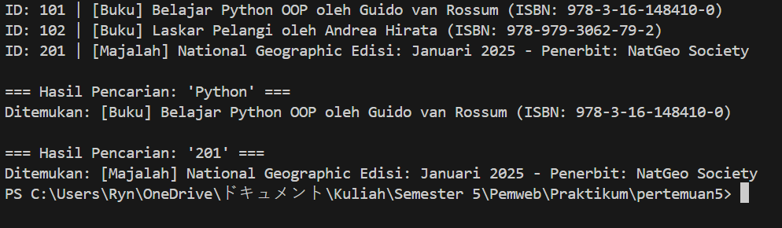

# Sistem Manajemen Perpustakaan Sederhana
**Nama:** Muharyan Syaifullah
**NIM:** 123140045
**Pertemuan:** 5

## Deskripsi Program
Program ini adalah aplikasi CLI sederhana berbasis Python untuk mengelola koleksi perpustakaan. Program dibangun menggunakan paradigma Object-Oriented Programming (OOP) yang mencakup konsep:
- **Abstract Class:** Sebagai blueprint dasar item perpustakaan.
- **Inheritance:** Pewarisan sifat ke class Buku dan Majalah.
- **Encapsulation:** Perlindungan data ID dan Judul menggunakan access modifiers.
- **Polymorphism:** Penggunaan method yang sama untuk tipe objek berbeda.

## Fitur Utama
1. **Menambah Item:** Mendukung penambahan Buku dan Majalah.
2. **Lihat Koleksi:** Menampilkan seluruh daftar koleksi dengan detail spesifik.
3. **Pencarian:** Mencari item berdasarkan kata kunci Judul atau ID unik.

## Screenshot Hasil Running
Berikut adalah tampilan program saat dijalankan:



## Cara Menjalankan Program
1. Pastikan Python 3.x sudah terinstall.
2. Buka terminal di folder proyek.
3. Jalankan perintah:
   ```bash
   python main.py